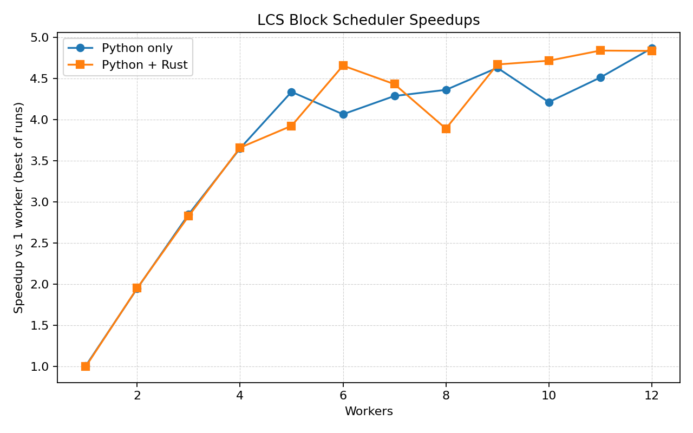

# Sucuri
Python Dataflow Programming Library

Read the examples and the referenced papers as I do not have a written tutorial (yet).


This is the current repository for Sucuri, python 2.7.x was dropped, so python 3.x is now **required**.

A completely new version with hierarchical distributed scheduling and fault tolerance is on its way.


- Tiago Alves <tiago@ime.uerj.br>

## Python 3.14 no-GIL branch

This branch tracks CPython **3.14**’s experimental no-GIL runtime and ships a local build under `./cpython/python`. All examples, benchmarks, and tests should be executed with that interpreter:

```bash
./cpython/python -m unittest
```

Thread scheduling inside `pyDF` benefits directly from the removal of the global interpreter lock, allowing worker threads to run truly concurrently while keeping the existing API intact.

### Rust-accelerated nodes

A new optional `@rust` decorator (`pyDF.integrations.rust`) lets you wrap any node function with a Rust implementation while still providing a pure-Python fallback. The Longest Common Subsequence (LCS) example uses this bridge to offload block updates to a Rust extension (`rust/sucuri_lcs`).

Run the benchmark helper to compare the Python-only and Rust-backed kernels:

```bash
./cpython/python examples/LCS/benchmark_lcs_speedups.py --length 4096 --block 256 --repeats 3
```

This command rebuilds the Rust crate, measures the best-of-three runtimes for 1–12 workers on randomly generated DNA sequences of length 4096, and emits a plot at `examples/LCS/lcs_speedup.png`. The current run produced the following speedups (relative to the best single-worker result for each backend):

| Workers | Python-only | Python + Rust |
|---------|-------------|---------------|
| 1       | 1.01×       | 1.00×         |
| 4       | 3.65×       | 3.66×         |
| 8       | 4.36×       | 3.89×         |
| 12      | 4.87×       | 4.83×         |

Mean speedup across all worker counts: **3.73×** (Python) vs **3.78×** (Python + Rust).

View the full curve in `examples/LCS/lcs_speedup.png`:



**Selected Papers**

[1] ALVES, T. A. O., GOLDSTEIN, B. F., FRANC ̧ A, F. M. G., et al. “A Minimalistic Dataflow Programming Library for Python”. In: 2014 International Symposium on Computer Architecture and High Performance Computing Workshop, pp. 96–101, Oct 2014. doi: 10.1109/SBAC-PADW.2014.20.

[2] R. J. N. Silva et al., "Task Scheduling in Sucuri Dataflow Library," 2016 International Symposium on Computer Architecture and High Performance Computing Workshops (SBAC-PADW), 2016, pp. 37-42, doi: 10.1109/SBAC-PADW.2016.15.

[3] A. C. Sena, E. S. Vaz, F. M. G. França, L. A. J. Marzulo and T. A. O. Alves, "Graph Templates for Dataflow Programming," 2015 International Symposium on Computer Architecture and High Performance Computing Workshop (SBAC-PADW), 2015, pp. 91-96, doi: 10.1109/SBAC-PADW.2015.20.
