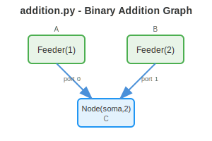
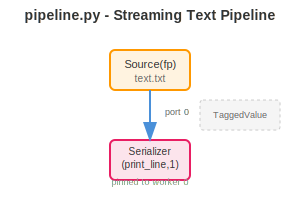
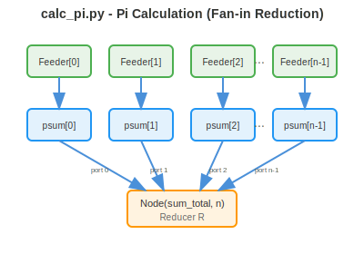
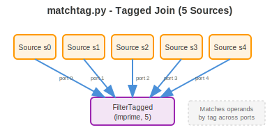
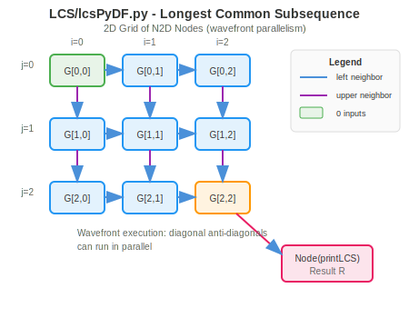

# Sucuri Examples

This directory contains example dataflow graphs demonstrating Sucuri's capabilities. Each example shows a different pattern for composing nodes, wiring edges, and leveraging the scheduler.

---

## addition.py - Binary Addition

The simplest possible Sucuri graph: two `Feeder` nodes emit constants that converge into a single computation node.



```python
A = Feeder(1)
B = Feeder(2)
C = Node(soma, 2)

A.add_edge(C, 0)
B.add_edge(C, 1)
```

**Key concepts:** Feeders, multi-input nodes, port numbering.

---

## pipeline.py - Streaming Text Pipeline

A `Source` reads lines from a file and streams them through a `Serializer` that maintains output order despite parallel execution.



```python
src = Source(fp)
printer = Serializer(print_line, 1)
printer.pin(0)  # Pin to worker 0 for ordered output

src.add_edge(printer, 0)
```

**Key concepts:** Source iteration, TaggedValue, Serializer, worker pinning.

---

## calc_pi.py - Pi Calculation (Fan-in Reduction)

Demonstrates a map-reduce pattern: multiple worker nodes compute partial sums that fan into a single reducer node.



```python
R = Node(sum_total, nprocs)  # Reducer with n input ports

for i in range(nprocs):
    Id = Feeder([stride, i, nprocs])
    Spartial = Node(psum, 1)

    Id.add_edge(Spartial, 0)
    Spartial.add_edge(R, i)  # Each partial sum goes to a unique port
```

**Key concepts:** Dynamic graph construction, fan-in patterns, port-per-producer.

---

## matchtag.py - Tagged Join

Five `Source` nodes emit tagged integers that converge into a `FilterTagged` node. The filter waits for matching tags across all input ports before firing.



```python
sources = [Source(range(n)) for _ in range(5)]
joiner = FilterTagged(imprime, 5)

for port, src in enumerate(sources):
    src.add_edge(joiner, port)
```

**Key concepts:** Multiple sources, TaggedValue synchronization, FilterTagged joins.

---

## LCS/lcsPyDF.py - Longest Common Subsequence

A 2D grid of custom `N2D` nodes computes the LCS matrix using wavefront parallelism. Each cell depends on its left and upper neighbors, enabling diagonal anti-diagonals to execute in parallel.



```python
# Create 2D grid of nodes
G = [[N2D(compute, inputs(i,j), i, j) for j in range(gW)] for i in range(gH)]

# Wire dependencies
for i in range(gH):
    for j in range(gW):
        if i > 0:  # Upper neighbor dependency
            G[i-1][j].add_edge(G[i][j], 0, 0)
        if j > 0:  # Left neighbor dependency
            G[i][j-1].add_edge(G[i][j], int(i>0), 1)

# Final result
R = Node(printLCS, 1)
G[gH-1][gW-1].add_edge(R, 0)
```

**Key concepts:** Custom Node subclass (N2D), 2D grid topology, wavefront parallelism, multi-output ports.

---

## Other Examples

| Directory/File | Description |
|----------------|-------------|
| `sum.py` | Simple summation example |
| `rgb2gray.py` | Image processing pipeline |
| `render_blender.py` | Blender rendering distribution |
| `optimizaiton.py` | Optimization workflow |
| `TSPSucuri/` | Traveling Salesman Problem solver |
| `numerical_integration/` | Numerical integration with optional SWIG bindings |
| `videoStreamProcessing/` | Video frame processing pipeline |
| `mine/` | Custom scheduler experiments |

---

## Running Examples

Most examples require the `PYDFHOME` environment variable:

```bash
export PYDFHOME=/path/to/sucuri
python examples/addition.py
python examples/pipeline.py 4  # 4 workers
python examples/calc_pi.py 4 0.0001  # 4 workers, stride
python examples/matchtag.py 4 10  # 4 workers, n iterations
```

For LCS:
```bash
cd examples/LCS
python lcsPyDF.py ../seqA.txt ../seqB.txt 4 2  # 4 workers, block size 2
```
